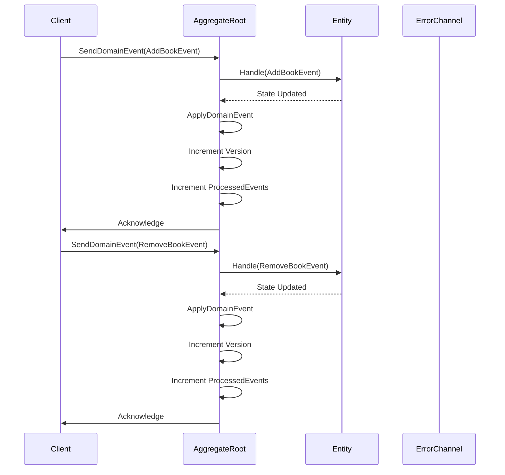

# Aggregate Root Example in Go

This repository demonstrates how to implement and use the `AggregateRoot` pattern in Go using Domain-Driven Design (DDD) principles. The example showcases a simple library system where you can add and remove books.

## Overview

The `AggregateRoot` implementation manages domain events and maintains the state of an entity (in this case, a `Library`). It ensures that all business rules are enforced and that the state remains consistent.

## Getting Started

1. **Clone the Repository**

   ```bash
   git clone https://github.com/sosalejandro/ddd-golang.git
   cd ddd-golang
   ```

2. **Initialize Go Modules**

   Ensure Go is installed on your machine. Initialize the modules:

   ```bash
   go mod tidy
   ```

3. **Run the Example**

   Navigate to the example directory and run the application:

   ```bash
   cd examples/library
   go run main.go
   ```

## Usage

### Instantiating AggregateRoot

To use the `AggregateRoot`, you need to:

1. **Define Your Aggregate Root Entity**

   In this example, `Library` is the aggregate root managing books.

2. **Create Domain Events**

   Define events such as `addBookEvent` and `removeBookEvent` that represent significant state changes.

3. **Instantiate AggregateRoot**

    The *AggregateRoot* takes an *Entity* which implements *AggregateRootInterface*.

    ```go
    // AggregateRootInterface is an interface that represents an aggregate root entity.
    type AggregateRootInterface interface {
        // Handle handles domain events.
        Handle(event IDomainEvent) error
        // ValidateState validates the state of the aggregate root.
        ValidateState() error
        // SetDomainEventsChannel sets the channel to send domain events.
        SetDomainEventsChannel(ch chan<- IDomainEvent)
        // SendDomainEvent sends a domain event.
        SendDomainEvent(event IDomainEvent)
    }
    ```
    
    _When the cancellation doesn't come from the context, the deferred call to the `close` function from the AggregateRoot should be made to manage the disposal of the inner channels._
    
    _The `errCh` is responsible for being closed within the `closeChannel` function since its sender should be in charge of closing the channel._
    
    ### With Cancel
    ```go
    lib := library.NewLibrary()
    errCh := make(chan error, 10)
    ctx, cancel := context.WithCancel(context.Background())
    defer cancel()

    ar, _ := pkg.NewAggregateRoot(ctx, lib, errCh)
    ```

    ### Without Cancel

    ```go
    lib := library.NewLibrary()
    errCh := make(chan error, 10)
    ctx := context.Background()

    ar, closeChannel := pkg.NewAggregateRoot(ctx, lib, errCh)
    defer closeChannel()
    ```

### Interacting with AggregateRoot

1. Use the entity's methods to handle domain events:

    ### Library Operations

    ```go
    // Start a goroutine to handle errors.
    go func() {
        for err := range errCh {
            if err != nil {
                log.Printf("Error: %v\n", err)
            }
        }
    }()

    // Add and remove books.
    lib.AddBook("The Hobbit")
    lib.RemoveBook("The Hobbit")

    // Wait until processed events count is 2 or context is canceled.
    if err := ar.WaitForEvents(ctx, 2); err != nil {
        log.Println(err)
        return
    }
    ```

2. Use the Aggregate to handle the entity's state recreation

   ### Aggregate Operations
    ```go
    // Start a goroutine to handle errors.
    go func() {
        for err := range errCh {
            if err != nil {
                log.Printf("Error: %v\n", err)
            }
        }
    }()

    history := []aggregate.IDomainEvent{
        &addBookEvent{Title: "The Hobbit"},
        &removeBookEvent{Title: "The Hobbit"},
        &addBookEvent{Title: "Harry Potter and the Philosopher's Stone"},
        &removeBookEvent{Title: "Harry Potter and the Philosopher's Stone"},
        &addBookEvent{Title: "Harry Potter and the Chamber of Secrets"},
        &removeBookEvent{Title: "Harry Potter and the Chamber of Secrets"},
        &addBookEvent{Title: "Harry Potter and the Prisoner of Azkaban"},
        &removeBookEvent{Title: "Harry Potter and the Prisoner of Azkaban"},
    }

    // Load the history.
    ar.Load(history)

    if err := ar.WaitForEvents(ctx, len(history)); err != nil {
        log.Println(err)
        return
    }
    ```

### Aggregate Root and Entity Internals

The implementation heavily relies on the Entity (Aggregate Root) implementing the `AggregateRootInterface` as demonstrated in the following code:

```go
// library is an aggregate root that represents a library.
type library struct {
	books map[string]*book
	ch    chan<- aggregate.IDomainEvent
}

// SetDomainEventsChannel sets the channel to send domain events.
func (l *library) SetDomainEventsChannel(ch chan<- aggregate.IDomainEvent) {
	l.ch = ch
}

// SendDomainEvent sends a domain event.
func (l *library) SendDomainEvent(event aggregate.IDomainEvent) {
	l.ch <- event
}

// Handle handles domain events.
func (l *library) Handle(event aggregate.IDomainEvent) error {
	switch e := event.(type) {
	case *addBookEvent:
		return l.handleAddBookEvent(e)
	case *removeBookEvent:
		return l.handleRemoveBookEvent(e)
	}
	return nil
}

// ValidateState validates the state of the library.
func (l *library) ValidateState() error {
	var errs error
	for _, b := range l.books {
		if err := b.validate(); err != nil {
			if errs == nil {
				errs = err
				continue
			}
			errs = errors.Join(errs, err)
		}
	}
	return errs
}
```

The entity expected to implement the *`AggregateRoot`* has a direct implementation of a channel as a field, but it doesn't manage its state. It is expected that the sender closes the channel but for this case, the *`AggregateRoot`* is on charge of the state as the entity should be considered on other languages as the *`AggregateRoot`*, this implementation is just a _'hack'_ to go around the _*Golang*_ capabilities to compose code and implement this pattern. At the moment of writing this code we lack of abstract classes on Golang and embedding isn't an idiomatic composition of a class so channels are a by-pass to communicate between these two classes which have direct dependencies, they should be look as one entity on the big picture but on the practice they are 2 different objects, but closely related. 

#### How objects are sent to the Aggregate?

We make usage of the *`SendDomainEvent(IDomainEvent)`* method to communicate to the *`AggregateRoot`* through the _`domainEventCh`_ the operations which mutate the state of the *`AggregateRoot`* Entity 

```go
// AddBook adds a book to the library.
func (l *library) AddBook(title string) {
	l.SendDomainEvent(&addBookEvent{Title: title})
}

// RemoveBook removes a book from the library.
func (l *library) RemoveBook(title string) {
	l.SendDomainEvent(&removeBookEvent{Title: title})
}
```

These Events are sent and proccessed by the `AggregateRoot` through the `listenDomainEvents` method and then it calls per every `DomainEvent` received the `ApplyDomainEvent` method.

```go
// listenDomainEvents listens for domain events.
// It listens for domain events and applies them.
// It closes the domain events channel when the context is done.
// It sends an error to the error channel if there is an error.
// listenDomainEvents listens for incoming domain events and processes them.
func (ar *AggregateRoot[T]) listenDomainEvents(ctx context.Context) {
	for {
		select {
		case event, ok := <-ar.domainEventCh:
			if !ok {
				ar.closeChannel()
				return
			}
			if err := ar.ApplyDomainEvent(event); err != nil {
				ar.errCh <- err
			}
		case <-ctx.Done():
			ar.closeChannel()
			return
		}
	}
}

// ApplyDomainEvent applies a domain event.
// It validates the state of the entity.
// It increments the version.
// It increments the processed events.
// It returns an error if the state is invalid.
func (ar *AggregateRoot[T]) ApplyDomainEvent(event IDomainEvent) (err error) {
	if err = ar.entity.Handle(event); err != nil {
		return err
	}

	if err = ar.entity.ValidateState(); err != nil {
		return err
	}

	atomic.AddInt32(&ar.processedEvents, 1)
	select {
	case ar.eventProcessedCh <- struct{}{}:
	default:
	}

	ar.changes = append(ar.changes, event)
	ar.Version++
	return nil
}
```

As these methods are expected to flow through eventually consistency and channels are used for communication between the two structs, a `WaitForEvents` method was implemented on the `AggregateRoot` to use as a mechanism of promise handling. It expects a `targetCount` parameter which should reflect how many operations are expected to be performed. Once these operations match the condition of the `for` loop which is used on this example as a `while` on other languages, it proceeds to exit and return `nil`.

```go
// WaitForEvents waits until the target count of events is processed or the context is canceled.
func (ar *AggregateRoot[T]) WaitForEvents(ctx context.Context, targetCount int) error {
	for ar.GetProcessedEventsCount() < targetCount {
		select {
		case <-ar.eventProcessedCh:
			// Continue waiting
		case <-ctx.Done():
			return fmt.Errorf("operation canceled while waiting for events")
		}
	}
	return nil
}
```

## Internal Communication

The `AggregateRoot` uses channels to handle asynchronous processing of domain events. When an event is sent to the `domainEventCh` a goroutine listens and applies the event, updating the state accordingly.

### Channel Flow

1. **Event Emission**

   Events are sent to the `domainEventCh` via the `SendDomainEvent` method.

2. **Event Processing**

   A goroutine listens on `domainEventCh` and applies each event using `ApplyDomainEvent`.

3. **Error Handling**

   If `ApplyDomainEvent` encounters an error, it's sent to the `errCh`.

1. **State Update**

   After applying an event, the `AggregateRoot` updates its version and increments the processed events count.

## Handling Cancellation

Both `listenDomainEvents` and `WaitForEvents` functions monitor the context's cancellation via `ctx.Done()`. When the context is canceled, both functions initiate their shutdown processes by closing the channels and exiting gracefully. This ensures that all operations are properly canceled, preventing resource leaks or deadlocks.

### Example

## Sequence Diagram



## Dependencies

- [Go](https://golang.org/) 1.18+
- [Testify](https://github.com/stretchr/testify) for assertions in tests.


# Conclusion

This example demonstrates how to implement and use the `AggregateRoot` pattern in Go, facilitating clean architecture and separation of concerns. By leveraging Go's concurrency features and interfaces, you can build robust and maintainable domain-driven applications.